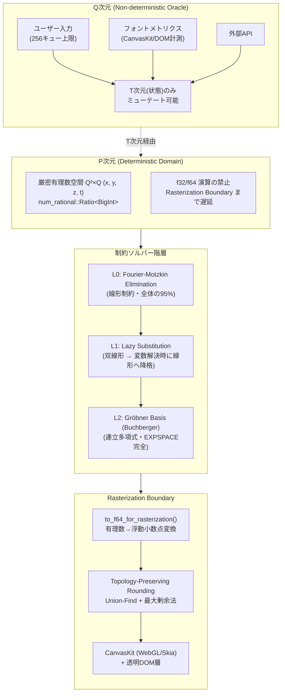
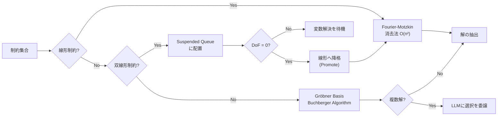
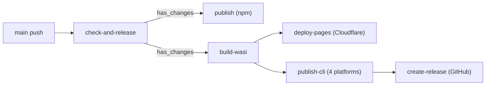

# ViewScript Project Specification

## 1. 基礎公理系 (Fundamental Axioms)

ViewScriptは、グラフィカルユーザーインターフェース（GUI）を 「$\mathbb{Q}^3 \times \mathbb{Q}$（空間XYZ＋時間状態T）の連続的・厳密有理数空間における制約充足問題（CSP）」として数学的に厳密に定式化した、新規性の高いレンダリングフレームワークである。

## 2. インストール

```bash
curl -fsSL https://viewscript.pages.dev/install.sh | sh
```

対応プラットフォーム:
- Linux x86_64
- macOS x86_64 / ARM64 (Apple Silicon)
- Windows x86_64

## 3. システムアーキテクチャ

### 3.1 次元分離の公理的基盤

ViewScriptの根幹をなす設計原理は、決定論的空間と非決定論的オラクルの厳密な分離である。以下にシステム全体の階層構造を示す。



### 3.2 制約解決パイプライン

制約グラフの解決は、計算量爆発を回避するため、以下の階層的パイプラインによって実行される。



## 4. 設計判断の理論的根拠

以下の表に、ViewScriptが直面した技術的課題とその解決手法を整理する。

| 課題 | 解決手法 | 理論的根拠 |
|:-----|:---------|:-----------|
| 浮動小数点演算の非決定性 | 有理数型 `Rational(Ratio<BigInt>)` による厳密演算 | IEEE 754の丸めモードがプラットフォーム依存であるため、LEAN 4における `Decidable` 証明との整合性を担保 |
| ソルバーの計算量爆発 | L0→L1→L2 階層的遅延評価 | Gröbner基底計算はEXPSPACE完全であり、95%を占める線形制約をFM消去法で処理することで平均計算量を抑制 |
| G1連続性（曲線接続）の表現 | 共線性制約を双線形項 $(H_1.y-P.y)(H_2.x-P.x) = (H_2.y-P.y)(H_1.x-P.x)$ で定式化 | 三点共線性条件を除算なしで表現し、変数解決時に線形制約へ降格 |
| 円弧端点の座標計算 | `CircumferenceConstraint` による遅延評価 | 二次制約 $(P.x-C.x)^2+(P.y-C.y)^2=R^2$ を中心・半径解決後に評価 |
| ピクセル境界における1px隙間 | Union-Findによる等価クラス構築と最大剰余法 | 隣接面の座標を同一等価クラスに配置し、一括丸めによりトポロジーを保存 |
| LLMとの統合 | CODL (Turing-incomplete YAML DSL) | 静的検証器により停止性・有界性・参照健全性を実行前に証明 |

## 5. モジュール構成

本プロジェクトのモジュール構成を以下に示す。

| Crate / Package | 責務 | 主要な実装 |
|:----------------|:-----|:-----------|
| `vsc-core` | 型定義・制約ソルバー・代数的幾何学演算 | `Rational`, `ConstraintSolver`, `compute_groebner_basis()` |
| `vsc-codl` | LLM発行YAML命令のパース・解釈 | `CodlParser`, `CodlInterpreter` |
| `vsc-cli` | コマンドラインインターフェース | 自己修復エージェント (`self_healing_agent.rs`) |
| `vsc-launcher` | ネイティブランチャー（WASI実行・自動更新） | wasmtime統合、zstd解凍、バージョンチェック |
| `vsc-wasm` | `vsc-core` のWebAssemblyバインディング | `pub use vsc_core::*` による全再エクスポート |
| `vsc-gpu` | GPU描画コマンド生成 | シーンコンバーター、wgpu統合 |
| `vsc-ffi-c` | C言語バインディング | `vsc_init()`, `vsc_add_constraint()` 等 |
| `vsc-linter` | 静的解析（浮動小数点汚染・循環参照検出） | `float_contamination.rs`, `cycle_detection.rs` |
| `@viewscript/renderer` | TypeScript側ラスタライズ層 | `topology-rounding.ts`, `event-backpressure.ts` |
| `@viewscript/wasm` | WASM npmパッケージ | wasm-pack生成 |
| `@viewscript/browser-defaults` | ブラウザデフォルトコンポーネント | `RoundedRect.vs`, `Text.vs` |

## 6. 配布アーキテクチャ

### 6.1 CLIバイナリ配布

```
viewscript.pages.dev/releases/
  bin/vsc-core.wasm.zst          ← WASIバイナリ（zstd圧縮）
  version/latest                 ← バージョン文字列

GitHub Releases:
  vsc-linux-x86_64               ← ネイティブランチャー
  vsc-macos-x86_64
  vsc-macos-aarch64
  vsc-windows-x86_64.exe

ユーザーマシン (~/.viewscript/):
  bin/vsc-core.wasm              ← 解凍済みキャッシュ
  version                        ← 現在のバージョン
  last_check                     ← 更新チェック時刻
```

### 6.2 自動更新フロー

```
vsc (ネイティブランチャー)
  → 起動時: 1時間に1度 version/latest を確認
  → 更新あり: bin/vsc-core.wasm.zst をダウンロード → zstd解凍 → 配置
  → wasmtime で vsc-core.wasm を実行、CLIの引数をそのまま渡す
```

## 7. CI/CDパイプライン



12時間ごとのスケジュール実行、または手動トリガーで発火。

## 8. 形式検証との対応

本プロジェクトは `rfc/lean/ViewScriptRFC/PDimension.lean` においてLEAN 4による公理化が進行中である。Rust実装における `Rational`, `PVector`, `Constraint` 等の型は、LEAN 4での形式的定義と同型を保つよう設計されている。

制約優先度 (`ConstraintPriority::Hard` / `ConstraintPriority::Soft`) による階層的シャドウイング機構は、コンポーネント合成時における制約衝突の自動解決を可能とする。

## 9. 公理系

*   **Axiom 1 (次元の直交分離):** 全てのシステムは決定論的な有理数空間である「P次元」と、非決定論的オラクル（ユーザー入力、フォントバイナリ、外部API）である「Q次元」に厳密に分離される。
*   **Axiom 2 (ウロボロス・バインディング):** Q次元の入力は、P次元の空間座標（XYZ）を直接操作できない。Q次元はP次元の「Tベクトル（状態・時間）」のみをミューテートし、空間座標はTを独立変数とする制約グラフの再評価によってのみ導出される。
*   **Axiom 3 (浮動小数点汚染の排除):** P次元コアロジック内での超越関数（$\sin, \cos$）および浮動小数点（`f32/f64`）演算を禁ずる。これらはラスタライズ境界（Rasterization Boundary）での遅延評価としてのみ許可される。

## 10. 数理的境界と解決器 (Mathematical Boundaries & Solvers)

制約グラフは、計算量爆発を防ぐため、以下の階層的パイプラインによって決定論的に解決される。

*   **L0 (Linear - Fourier-Motzkin Elimination):**
    一次不等式・等式系。$O(n^2)$ で高速に解決可能。システムの95%の制約（配置、整列、パディング）を処理する。
*   **L1 (Lazy Substitution - Bilinear/Quadratic):**
    G1連続性や円弧などから生じる双線形・二次制約。自由度（DoF）が0に収束した変数を定数代入することで次数を降下させ、L0へ昇格（Promote）させる遅延評価キュー。
*   **L2 (Algebraic Geometry - Gröbner Basis):**
    L0/L1で解決不能な連立多項式系（アポロニウスの問題等）。Buchbergerアルゴリズムにより辞書式順序でイデアルの基底を計算する（EXPSPACE完全）。実数解のみを抽出し、複数解はLLMに選択を委譲する。
*   **剛性と特異点の静的解析 (Rigidity & Singularity):**
    Lamanの定理に基づくペブルゲーム（$|E| \le 2|V| - 3$）により過剰制約を $O(V^2)$ で事前検知する。ヤコビ行列のランク判定により幾何学的特異点を警告する。

## 11. 工学的構造と制約 (Engineering Constraints & Architecture)

*   **Bilayer Orthogonal Architecture:**
    レンダリングは、視覚を100%担う `CanvasKit`（WebGL/Skia）層と、触覚・セマンティクスを担う透明な `DOM` 層に分離される。DOM層へのブラウザレイアウトエンジンの介入（Reflow）は完全に排除され、`transform: translate3d` による絶対配置のみが許可される。
*   **Topology-Preserving Rounding:**
    有理数からピクセルグリッドへの射影時、1pxの隙間（アーティファクト）を防ぐため、Union-Findによる等価クラス構築と最大剰余方式（Largest Remainder Method）を適用し、空間的閉包を保証する。
*   **CODL (Constraint Operation Description Language):**
    LLMが発行する操作は、チューリング不完全なYAML/JSON DSLとして定義される。静的検証器により、停止性（ネスト深度上限）、有界性、参照健全性が実行前に証明される。
*   **Hierarchical Shadowing:**
    コンポーネント（`.vs`）内の `Soft` 制約は、親スコープからの `Hard` 制約と衝突した場合、暗黙的にシャドウイング（無効化）され、トポロジーの破綻を防ぐ。

## 12. 既知の限界と意図的技術的負債 (Known Limitations & Intentional Debt)

現行アーキテクチャは以下の境界条件を意図的に許容している。次期フェーズにおいてこれらを認識した上で設計を行うこと。

1.  **Gröbner基底の次数爆発:** 変数>50かつ次数>4の系でメモリ爆発の危険。現在 `MAX_POLYNOMIAL_DEGREE = 4` およびタイムアウトで保護。
2.  **テキストメトリクスの循環参照:** Q次元（フォント計測）とP次元（幅制約）間の循環はDAGソートで検知するが、深さ100以上の間接循環の検知精度は未保証。
3.  **有理数精度の限界:** `Rational` から `f64` への変換時、分子/分母が $2^{53}$ を超える極端なアスペクト比でIEEE 754精度損失の可能性。
4.  **2D剛性解析の限界:** 現在のLaman条件は2D平面専用。Z軸はレイヤー順序としてのみ機能。
5.  **動的配列制約:** カラーストップ（Gradient）の数はFM決定可能性維持のため静的固定。
6.  **超越関数の有理数近似:** CSS角度の $\sin, \cos$ 変換は特定角度（0, 30, 45...）のみ厳密解、それ以外はテイラー展開による近似。
7.  **イベントキュー飽和:** 1000 events/sec を超えるQ次元入力は、レイテンシ優先のため意図的にドロップ（最大256キュー）。

## 13. 拡張公理 (Axioms for Future Expansion)

Phase 18以降の拡張において、以下の新規公理をシステムに統合する準備がなされている。

*   **3D空間への昇格 (Spatial Elevation):** $P = (x, y, z, t)$ における $z$ を連続有理数空間へ昇格する。剛性理論は $3n-6$ へ移行する。
*   **シェーダーとP次元の同型性 (Shader Isomorphism):** カスタムフラグメントシェーダー（WGSL/GLSL）の Uniform 変数は、P次元の射影像として定義される。
*   **外部信号のT次元バインディング (Signal-to-T Binding):** Web Audio API等の連続信号は、Q次元で離散化された後、T次元の汎用パラメータとしてP次元に注入される。
*   **物理制約の微分方程式化 (ODE Constraints):** 物理シミュレーションは、時間発展演算子 $T(t+dt) = f(T(t))$ として定義され、線形ODEクラスに限定してソルバに統合される。
*   **分散制約合意 (Distributed Constraint Consensus):** マルチウィンドウ間の制約グラフ共有は、論理クロックを用いたCRDT的アプローチによって因果順序を保証する。

## 14. ディレクトリ構造

```
.
├── .github/
│   └── workflows/
│       ├── ci.yml
│       ├── llm-drift-check.yml
│       └── npm-publish.yml
├── .gitignore
├── .vs-dev/
│   └── index.html
├── Cargo.lock
├── Cargo.toml
├── crates/
│   ├── vsc-cli/
│   │   ├── Cargo.toml
│   │   ├── src/
│   │   │   ├── commands/
│   │   │   │   └── mod.rs
│   │   │   ├── embedded_wasm.rs
│   │   │   └── main.rs
│   │   └── tests/
│   │       ├── fixtures/
│   │       │   ├── path_with_fill.vscmd.yaml
│   │       │   └── stack_vertical.vscmd.yaml
│   │       ├── integration_harness.rs
│   │       ├── run_command_path_entity.rs
│   │       ├── search_command.rs
│   │       ├── self_healing_agent.rs
│   │       └── target_management.rs
│   ├── vsc-codl/
│   │   ├── Cargo.toml
│   │   └── src/
│   │       ├── ast.rs
│   │       ├── error.rs
│   │       ├── interpreter.rs
│   │       ├── lib.rs
│   │       ├── parser.rs
│   │       ├── schema.rs
│   │       └── validator.rs
│   ├── vsc-core/
│   │   ├── Cargo.toml
│   │   └── src/
│   │       ├── algebra/
│   │       │   ├── groebner.rs
│   │       │   ├── mod.rs
│   │       │   ├── monomial.rs
│   │       │   └── polynomial.rs
│   │       ├── analyzer/
│   │       │   ├── jacobian.rs
│   │       │   ├── mod.rs
│   │       │   ├── rigidity.rs
│   │       │   └── singularity.rs
│   │       ├── buildinfo.rs
│   │       ├── collision.rs
│   │       ├── component.rs
│   │       ├── config.rs
│   │       ├── ffi.rs
│   │       ├── lib.rs
│   │       ├── optimizer.rs
│   │       ├── proptest_checks.rs
│   │       ├── regression_promoter.rs
│   │       ├── scene.rs
│   │       ├── schema.rs
│   │       ├── solver.rs
│   │       ├── target.rs
│   │       ├── telemetry.rs
│   │       ├── text.rs
│   │       ├── types.rs
│   │       └── validator.rs
│   ├── vsc-ffi-c/
│   │   ├── Cargo.toml
│   │   ├── cbindgen.toml
│   │   └── src/
│   │       └── lib.rs
│   ├── vsc-gpu/
│   │   ├── benches/
│   │   │   ├── loop_blinn_bench.rs
│   │   │   └── sdf_stroke_bench.rs
│   │   ├── CANVAS2D_COVERAGE.md
│   │   ├── Cargo.toml
│   │   ├── docs/
│   │   │   └── BENCHMARK_BASELINE.md
│   │   ├── FFI_ANALYSIS.md
│   │   └── src/
│   │       ├── batcher.rs
│   │       ├── lib.rs
│   │       ├── loop_blinn/
│   │       │   ├── convexity.rs
│   │       │   ├── cubic.rs
│   │       │   ├── mod.rs
│   │       │   ├── tessellator.rs
│   │       │   └── vertex.rs
│   │       ├── opacity.rs
│   │       ├── pipeline.rs
│   │       ├── rasterizer/
│   │       │   ├── distribution.rs
│   │       │   ├── mod.rs
│   │       │   ├── rounding.rs
│   │       │   └── union_find.rs
│   │       ├── renderer.rs
│   │       ├── scene_converter.rs
│   │       ├── sdf_stroke/
│   │       │   ├── cubic_tessellator.rs
│   │       │   ├── cubic_vertex.rs
│   │       │   ├── mod.rs
│   │       │   ├── tessellator.rs
│   │       │   └── vertex.rs
│   │       ├── shaders/
│   │       │   └── mod.rs
│   │       ├── stencil.rs
│   │       ├── tessellation.rs
│   │       ├── transform.rs
│   │       └── web_target.rs
│   ├── vsc-launcher/
│   │   ├── Cargo.toml
│   │   ├── embedded/
│   │   │   └── vsc-core.wasm.zst
│   │   └── src/
│   │       └── main.rs
│   ├── vsc-linter/
│   │   ├── Cargo.toml
│   │   └── src/
│   │       ├── checks/
│   │       │   ├── cycle_detection.rs
│   │       │   ├── float_contamination.rs
│   │       │   ├── global_state.rs
│   │       │   ├── locus_prohibition.rs
│   │       │   ├── mod.rs
│   │       │   └── nonlinear_constraint.rs
│   │       ├── lib.rs
│   │       └── main.rs
│   └── vsc-wasm/
│       ├── Cargo.toml
│       ├── DUAL_RENDERER_CHECK.md
│       ├── src/
│       │   ├── gpu.rs
│       │   └── lib.rs
│       ├── test-engine.html
│       └── test-webgpu.html
├── dist/
│   └── index.html
├── docs/
│   ├── ARCH_CONSTRAINTS.md
│   ├── BENCHMARK_BASELINE.md
│   ├── commands/
│   │   ├── add-component.md
│   │   ├── add-constraint.md
│   │   ├── add-entity.md
│   │   ├── add-layout.md
│   │   ├── add-object.md
│   │   ├── api-search.md
│   │   ├── apply-layout.md
│   │   ├── build.md
│   │   ├── check.md
│   │   ├── check-when.md
│   │   ├── check-where.md
│   │   ├── dev.md
│   │   ├── export-schema.md
│   │   ├── generate-schema.md
│   │   ├── help.md
│   │   ├── init.md
│   │   ├── optimize.md
│   │   ├── patch-constraint.md
│   │   ├── remove-constraint.md
│   │   ├── run-command.md
│   │   ├── search.md
│   │   ├── status.md
│   │   ├── style.md
│   │   ├── target.md
│   │   └── update-metrics.md
│   ├── concepts/
│   │   ├── box-model.md
│   │   ├── codl.md
│   │   ├── component.md
│   │   ├── constraint-solver.md
│   │   ├── ffi.md
│   │   ├── p-dimension.md
│   │   ├── q-dimension.md
│   │   ├── render-target.md
│   │   ├── scene-graph.md
│   │   └── t-dimension.md
│   ├── cosmic-text-investigation.md
│   ├── index.md
│   ├── install.sh
│   ├── openapi.yaml
│   └── reference/
│       ├── constraint.md
│       ├── entity-id.md
│       ├── fill-spec.md
│       ├── path-command.md
│       ├── path-segment.md
│       ├── q-value.md
│       ├── q-variable.md
│       ├── rational.md
│       └── stroke-spec.md
├── lean4/
│   └── ViewScript/
│       └── PathTypes.lean
├── package.json
├── packages/
│   ├── browser-defaults/
│   │   ├── package.json
│   │   ├── src/
│   │   │   ├── components/
│   │   │   │   ├── index.vs
│   │   │   │   ├── RoundedRect.vs
│   │   │   │   └── Text.vs
│   │   │   └── index.ts
│   │   └── tsconfig.json
│   ├── dev-server/
│   │   └── src/
│   │       └── hmr-controller.ts
│   └── renderer/
│       ├── package.json
│       ├── package-lock.json
│       ├── playwright.config.ts
│       ├── playwright-report/
│       │   ├── data/
│       │   │   ├── 0bafe4e0863f0e244bba68a838f73241f8f2efaa.md
│       │   │   └── 9281aca8abfb06c6cecb35d5ddd13d61f8c752d8.md
│       │   └── index.html
│       ├── src/
│       │   ├── ast/
│       │   │   └── types.ts
│       │   ├── compiler/
│       │   │   └── chunk-splitter.ts
│       │   ├── index.ts
│       │   ├── rasterizer/
│       │   │   ├── __tests__/
│       │   │   │   └── error-distribution.test.ts
│       │   │   ├── canvas-mapper.ts
│       │   │   ├── error-distribution.ts
│       │   │   ├── gradient-mapper.ts
│       │   │   └── topology-rounding.ts
│       │   ├── runtime/
│       │   │   ├── __tests__/
│       │   │   │   └── event-backpressure.test.ts
│       │   │   ├── event-backpressure.ts
│       │   │   ├── render-loop.ts
│       │   │   ├── wasm-resource-manager.ts
│       │   │   └── wgpu-renderer-adapter.ts
│       │   └── semantic/
│       │       ├── __tests__/
│       │       │   └── semantic-translator.test.ts
│       │       └── semantic-translator.ts
│       ├── test-results/
│       │   └── .last-run.json
│       ├── tests/
│       │   └── e2e/
│       │       ├── async-race.spec.ts
│       │       ├── bilayer-sync.spec.ts
│       │       ├── fullstack.spec.ts
│       │       ├── g1-continuity.spec.ts
│       │       ├── gradient-animation.spec.ts
│       │       ├── memory-stability.spec.ts
│       │       ├── path-topology.spec.ts
│       │       ├── performance-profile.spec.ts
│       │       ├── screenshot.spec.ts
│       │       ├── test-harness.html
│       │       ├── text-layout.spec.ts
│       │       ├── visual-demo.html
│       │       └── visual-regression.spec.ts
│       ├── tsconfig.json
│       └── vitest.config.ts
├── pnpm-workspace.yaml
├── rfc/
│   └── lean/
│       ├── lakefile.toml
│       ├── ViewScriptRFC.lean
│       └── ViewScriptRFC/
│           └── PDimension.lean
├── schemas/
│   ├── constraint-collision-error.schema.json
│   └── path-entity.schema.json
├── styles/
│   └── vs-style-chrome/
│       ├── Cargo.toml
│       └── src/
│           └── lib.rs
├── tests/
│   ├── llm-drift/
│   │   ├── baselines/
│   │   │   ├── card-grid.json
│   │   │   ├── modal-dialog.json
│   │   │   └── nav-bar.json
│   │   ├── drift-calculator.ts
│   │   ├── executor.ts
│   │   └── run-drift-check.ts
│   └── wasi-e2e/
│       ├── deterministic_runner.sh
│       ├── package.json
│       └── run_wasi_tests.sh
└── vs.md
```

## 15. 依存関係

```mermaid
flowchart TB
    %% ========================================
    %% vsc-core: 型定義・制約ソルバー・代数演算
    %% ========================================
    subgraph vsc_core["vsc-core"]
        direction TB
        CORE_LIB["lib.rs"]
        CORE_TYPES["types.rs"]
        CORE_SOLVER["solver.rs"]
        CORE_SCENE["scene.rs"]
        CORE_BUILDINFO["buildinfo.rs"]
        CORE_SCHEMA["schema.rs"]
        CORE_CONFIG["config.rs"]
        CORE_COLLISION["collision.rs"]
        CORE_FFI["ffi.rs"]
        CORE_TARGET["target.rs"]
        CORE_VALIDATOR["validator.rs"]
        CORE_TEXT["text.rs"]
        CORE_OPTIMIZER["optimizer.rs"]
        CORE_PROPTEST["proptest_checks.rs"]
        CORE_REGPROMO["regression_promoter.rs"]
        CORE_COMPONENT["component.rs"]
        CORE_TELEMETRY["telemetry.rs"]

        subgraph core_algebra["algebra/"]
            ALG_MOD["mod.rs"]
            ALG_MONO["monomial.rs"]
            ALG_POLY["polynomial.rs"]
            ALG_GROEB["groebner.rs"]
        end

        subgraph core_analyzer["analyzer/"]
            ANA_MOD["mod.rs"]
            ANA_JAC["jacobian.rs"]
            ANA_RIG["rigidity.rs"]
            ANA_SING["singularity.rs"]
        end
    end

    %% vsc-core 内部依存
    CORE_LIB --> CORE_TYPES
    CORE_LIB --> CORE_SOLVER
    CORE_LIB --> CORE_SCENE
    CORE_LIB --> ALG_MOD
    CORE_LIB --> ANA_MOD

    CORE_SOLVER -->|"ConstraintPriority, EntityId, Rational"| CORE_TYPES
    CORE_SOLVER -->|"ConstraintTerm, VsBuildInfo"| CORE_BUILDINFO

    CORE_SCENE -->|"VsBuildInfo"| CORE_BUILDINFO
    CORE_SCENE -->|"VarId"| CORE_SOLVER
    CORE_SCENE -->|"EntityId, Rational, PathCommand"| CORE_TYPES

    CORE_BUILDINFO -->|"DerivedQVariable, QVariable"| CORE_FFI
    CORE_BUILDINFO -->|"*"| CORE_TYPES

    CORE_SCHEMA -->|"VsBuildInfo"| CORE_BUILDINFO
    CORE_SCHEMA -->|"Constraint"| CORE_TYPES

    CORE_CONFIG -->|"ResolutionStrategyWeights"| CORE_COLLISION
    CORE_CONFIG -->|"TelemetryConfig"| CORE_TELEMETRY

    CORE_COLLISION -->|"*"| CORE_TYPES

    CORE_FFI -->|"SceneBounds, SceneNode"| CORE_SCENE
    CORE_FFI -->|"VarId"| CORE_SOLVER
    CORE_FFI -->|"EntityId, Rational"| CORE_TYPES

    CORE_TARGET -->|"SceneNode"| CORE_SCENE

    CORE_VALIDATOR -->|"Constraint, ConstraintTerm, Entity"| CORE_TYPES

    CORE_TEXT -->|"EntityId, PathCommand, Rational"| CORE_TYPES

    CORE_OPTIMIZER -->|"*"| CORE_TYPES
    CORE_PROPTEST -->|"*"| CORE_TYPES
    CORE_REGPROMO -->|"*"| CORE_TYPES
    CORE_COMPONENT -->|"*"| CORE_TYPES

    ANA_SING -->|"Constraint, ConstraintTerm, EntityId"| CORE_TYPES
    ANA_JAC -->|"Rational"| CORE_TYPES

    ALG_POLY -->|"Monomial, MonomialOrder"| ALG_MONO
    ALG_POLY -->|"Rational"| CORE_TYPES
    ALG_GROEB -->|"Monomial, MonomialOrder"| ALG_MONO
    ALG_GROEB -->|"Polynomial"| ALG_POLY
    ALG_GROEB -->|"Rational"| CORE_TYPES

    %% ========================================
    %% vsc-codl: CODL DSLパーサー・解釈器
    %% ========================================
    subgraph vsc_codl["vsc-codl"]
        direction TB
        CODL_LIB["lib.rs"]
        CODL_AST["ast.rs"]
        CODL_ERR["error.rs"]
        CODL_PARSER["parser.rs"]
        CODL_INTERP["interpreter.rs"]
        CODL_VALID["validator.rs"]
        CODL_SCHEMA["schema.rs"]
    end

    CODL_PARSER -->|"BinaryOp, CodlExpr"| CODL_AST
    CODL_PARSER -->|"CodlError, CodlResult"| CODL_ERR

    CODL_INTERP -->|"*"| CODL_AST
    CODL_INTERP -->|"CodlError, CodlResult"| CODL_ERR
    CODL_INTERP -->|"parse_expr, parse_where"| CODL_PARSER

    CODL_VALID -->|"*"| CODL_AST
    CODL_VALID -->|"*"| CODL_ERR
    CODL_VALID -->|"extract_variables, parse_expr"| CODL_PARSER

    CODL_SCHEMA -->|"CodlCommand"| CODL_AST

    %% ========================================
    %% vsc-cli: コマンドラインインターフェース
    %% ========================================
    subgraph vsc_cli["vsc-cli"]
        direction TB
        CLI_MAIN["main.rs"]
        CLI_CMD["commands/mod.rs"]
        CLI_EMBED["embedded_wasm.rs"]
    end

    CLI_MAIN --> CLI_CMD
    CLI_MAIN --> CLI_EMBED

    %% ========================================
    %% vsc-gpu: GPU描画コマンド生成
    %% ========================================
    subgraph vsc_gpu["vsc-gpu"]
        direction TB
        GPU_LIB["lib.rs"]
        GPU_BATCH["batcher.rs"]
        GPU_PIPE["pipeline.rs"]
        GPU_RENDER["renderer.rs"]
        GPU_SCENE["scene_converter.rs"]
        GPU_TESS["tessellation.rs"]
        GPU_TRANS["transform.rs"]
        GPU_OPAC["opacity.rs"]
        GPU_STENC["stencil.rs"]
        GPU_WEB["web_target.rs"]

        subgraph gpu_shaders["shaders/"]
            SHAD_MOD["mod.rs"]
        end

        subgraph gpu_loop_blinn["loop_blinn/"]
            LB_MOD["mod.rs"]
            LB_CONV["convexity.rs"]
            LB_CUBIC["cubic.rs"]
            LB_TESS["tessellator.rs"]
            LB_VERT["vertex.rs"]
        end

        subgraph gpu_sdf_stroke["sdf_stroke/"]
            SDF_MOD["mod.rs"]
            SDF_TESS["tessellator.rs"]
            SDF_VERT["vertex.rs"]
            SDF_CTESS["cubic_tessellator.rs"]
            SDF_CVERT["cubic_vertex.rs"]
        end

        subgraph gpu_rasterizer["rasterizer/"]
            RAS_MOD["mod.rs"]
            RAS_ROUND["rounding.rs"]
            RAS_DIST["distribution.rs"]
            RAS_UF["union_find.rs"]
        end
    end

    GPU_BATCH -->|"LoopBlinnVertex"| LB_MOD
    GPU_BATCH -->|"OpacityStack"| GPU_OPAC
    GPU_BATCH -->|"PipelineManager"| GPU_PIPE
    GPU_BATCH -->|"SdfStrokeVertex"| SDF_MOD
    GPU_BATCH -->|"hex_to_rgba"| SHAD_MOD
    GPU_BATCH -->|"StencilStack"| GPU_STENC
    GPU_BATCH -->|"tessellate_path"| GPU_TESS
    GPU_BATCH -->|"TransformStack"| GPU_TRANS

    GPU_PIPE -->|"LoopBlinnVertex"| LB_MOD
    GPU_PIPE -->|"SdfStrokeVertex"| SDF_MOD
    GPU_PIPE -->|"shader sources"| SHAD_MOD
    GPU_PIPE -->|"GpuVertex"| GPU_TESS

    GPU_RENDER -->|"DrawBatcher"| GPU_BATCH
    GPU_RENDER -->|"OpacityStack"| GPU_OPAC
    GPU_RENDER -->|"PipelineManager"| GPU_PIPE
    GPU_RENDER -->|"shader sources"| SHAD_MOD
    GPU_RENDER -->|"StencilStack"| GPU_STENC
    GPU_RENDER -->|"tessellate_path"| GPU_TESS
    GPU_RENDER -->|"TransformStack"| GPU_TRANS

    GPU_SCENE -->|"round_with_topology"| RAS_MOD
    GPU_SCENE -->|"hex_to_rgba"| SHAD_MOD

    GPU_WEB -->|"GpuRenderer"| GPU_RENDER
    GPU_WEB -->|"SceneConverter"| GPU_SCENE

    LB_TESS -->|"compute_curve_sign"| LB_CONV
    LB_TESS -->|"classify_cubic"| LB_CUBIC
    LB_TESS -->|"LoopBlinnVertex"| LB_VERT

    SDF_TESS -->|"SdfStrokeVertex"| SDF_VERT
    SDF_CTESS -->|"CubicSdfStrokeVertex"| SDF_CVERT

    RAS_ROUND -->|"UnionFind"| RAS_UF
    RAS_DIST -->|"Axis"| RAS_UF

    %% ========================================
    %% vsc-wasm: WebAssemblyバインディング
    %% ========================================
    subgraph vsc_wasm["vsc-wasm"]
        direction TB
        WASM_LIB["lib.rs"]
        WASM_GPU["gpu.rs"]
    end

    WASM_LIB --> WASM_GPU

    %% ========================================
    %% vsc-launcher: ネイティブランチャー
    %% ========================================
    subgraph vsc_launcher["vsc-launcher"]
        direction TB
        LAUNCH_MAIN["main.rs"]
    end

    %% ========================================
    %% vsc-linter: 静的解析ツール
    %% ========================================
    subgraph vsc_linter["vsc-linter"]
        direction TB
        LINT_LIB["lib.rs"]
        LINT_MAIN["main.rs"]

        subgraph lint_checks["checks/"]
            CHK_MOD["mod.rs"]
            CHK_FLOAT["float_contamination.rs"]
            CHK_CYCLE["cycle_detection.rs"]
            CHK_GLOB["global_state.rs"]
            CHK_LOCUS["locus_prohibition.rs"]
            CHK_NONLIN["nonlinear_constraint.rs"]
        end
    end

    LINT_LIB --> CHK_MOD
    CHK_FLOAT -->|"LintCheck, Severity"| LINT_LIB
    CHK_CYCLE -->|"LintCheck, Severity"| LINT_LIB
    CHK_GLOB -->|"LintCheck, Severity"| LINT_LIB
    CHK_LOCUS -->|"LintCheck, Severity"| LINT_LIB
    CHK_NONLIN -->|"LintCheck, Severity"| LINT_LIB

    %% ========================================
    %% vsc-ffi-c: C言語バインディング
    %% ========================================
    subgraph vsc_ffi_c["vsc-ffi-c"]
        direction TB
        FFIC_LIB["lib.rs"]
    end

    %% ========================================
    %% vs-style-chrome: スタイルテーマ
    %% ========================================
    subgraph vs_style_chrome["vs-style-chrome"]
        direction TB
        STYLE_LIB["lib.rs"]
    end

    %% ========================================
    %% クレート間依存
    %% ========================================
    CORE_TYPES -->|"Rational, EntityId, Constraint"| CODL_INTERP
    CORE_TYPES -->|"Rational, Scene"| CLI_CMD
    CORE_TYPES -->|"Rational, EntityId"| WASM_LIB
    CORE_TYPES -->|"Rational, PathEntity"| GPU_LIB
    CORE_TYPES -->|"Rational, FFI型"| FFIC_LIB
    CORE_TYPES -->|"ConstraintPriority"| STYLE_LIB

    CODL_INTERP -->|"CodlInterpreter"| CLI_CMD

    GPU_LIB -.->|"GpuRenderer"| WASM_GPU

    CLI_MAIN -.->|"WASI binary"| LAUNCH_MAIN

    %% ========================================
    %% 外部依存 (主要なもののみ)
    %% ========================================
    subgraph ext_math["num-*"]
        NUM_RAT["num-rational"]
        NUM_BIG["num-bigint"]
    end

    subgraph ext_serde["serde ecosystem"]
        SERDE["serde"]
        SERDE_JSON["serde_json"]
    end

    subgraph ext_gpu["GPU"]
        WGPU["wgpu"]
        LYON["lyon"]
    end

    subgraph ext_wasi["WASI Runtime"]
        WASMTIME["wasmtime"]
    end

    subgraph ext_lint["AST解析"]
        SYN["syn"]
    end

    CORE_TYPES -->|"Ratio&lt;BigInt&gt;"| NUM_RAT
    CORE_TYPES -->|"BigInt"| NUM_BIG
    CORE_TYPES -->|"Serialize"| SERDE
    GPU_LIB -->|"WebGPU"| WGPU
    GPU_TESS -->|"tessellation"| LYON
    LAUNCH_MAIN -->|"WASIp1"| WASMTIME
    LINT_LIB -->|"AST visitor"| SYN

    %% ========================================
    %% TypeScript パッケージ
    %% ========================================
    subgraph ts_renderer["@viewscript/renderer"]
        TS_INDEX["index.ts"]
        TS_TOPO["topology-rounding.ts"]
        TS_EVENT["event-backpressure.ts"]
        TS_CANVAS["canvas-mapper.ts"]
        TS_GRAD["gradient-mapper.ts"]
        TS_LOOP["render-loop.ts"]
        TS_WASM_MGR["wasm-resource-manager.ts"]
        TS_WGPU["wgpu-renderer-adapter.ts"]
        TS_SEMANTIC["semantic-translator.ts"]
    end

    subgraph ts_defaults["@viewscript/browser-defaults"]
        TS_DEF_INDEX["index.ts"]
        TS_ROUNDED["RoundedRect.vs"]
        TS_TEXT["Text.vs"]
    end

    subgraph ts_ext["External"]
        CANVASKIT["canvaskit-wasm"]
    end

    WASM_LIB -->|"wasm-pack"| TS_INDEX
    TS_CANVAS -->|"WebGL/Skia"| CANVASKIT
    TS_DEF_INDEX --> TS_INDEX

    %% ========================================
    %% スタイル定義
    %% ========================================
    classDef core fill:#fef3c7,stroke:#d97706
    classDef codl fill:#dbeafe,stroke:#2563eb
    classDef cli fill:#dcfce7,stroke:#16a34a
    classDef gpu fill:#fce7f3,stroke:#db2777
    classDef wasm fill:#e0e7ff,stroke:#4f46e5
    classDef launcher fill:#f3e8ff,stroke:#9333ea
    classDef linter fill:#ccfbf1,stroke:#14b8a6
    classDef ffi fill:#fee2e2,stroke:#dc2626
    classDef style fill:#fef9c3,stroke:#ca8a04
    classDef ts fill:#cffafe,stroke:#0891b2
    classDef ext fill:#f3f4f6,stroke:#6b7280

    class CORE_LIB,CORE_TYPES,CORE_SOLVER,CORE_SCENE,CORE_BUILDINFO,CORE_SCHEMA,CORE_CONFIG,CORE_COLLISION,CORE_FFI,CORE_TARGET,CORE_VALIDATOR,CORE_TEXT,CORE_OPTIMIZER,CORE_PROPTEST,CORE_REGPROMO,CORE_COMPONENT,CORE_TELEMETRY,ALG_MOD,ALG_MONO,ALG_POLY,ALG_GROEB,ANA_MOD,ANA_JAC,ANA_RIG,ANA_SING core
    class CODL_LIB,CODL_AST,CODL_ERR,CODL_PARSER,CODL_INTERP,CODL_VALID,CODL_SCHEMA codl
    class CLI_MAIN,CLI_CMD,CLI_EMBED cli
    class GPU_LIB,GPU_BATCH,GPU_PIPE,GPU_RENDER,GPU_SCENE,GPU_TESS,GPU_TRANS,GPU_OPAC,GPU_STENC,GPU_WEB,SHAD_MOD,LB_MOD,LB_CONV,LB_CUBIC,LB_TESS,LB_VERT,SDF_MOD,SDF_TESS,SDF_VERT,SDF_CTESS,SDF_CVERT,RAS_MOD,RAS_ROUND,RAS_DIST,RAS_UF gpu
    class WASM_LIB,WASM_GPU wasm
    class LAUNCH_MAIN launcher
    class LINT_LIB,LINT_MAIN,CHK_MOD,CHK_FLOAT,CHK_CYCLE,CHK_GLOB,CHK_LOCUS,CHK_NONLIN linter
    class FFIC_LIB ffi
    class STYLE_LIB style
    class TS_INDEX,TS_TOPO,TS_EVENT,TS_CANVAS,TS_GRAD,TS_LOOP,TS_WASM_MGR,TS_WGPU,TS_SEMANTIC,TS_DEF_INDEX,TS_ROUNDED,TS_TEXT ts
    class NUM_RAT,NUM_BIG,SERDE,SERDE_JSON,WGPU,LYON,WASMTIME,SYN,CANVASKIT ext
```
